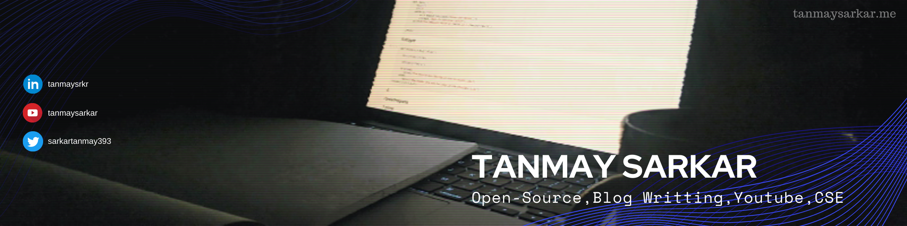

<h1 align="center"> Hi Folks  </h1>

<b> I am studying Computer Science and Engineering and exploring myself with various approaches. Besides that, I write blogs, make youtube content. Currently, learning DSA with <a href="https://github.com/kunal-kushwaha">Kunal Kushwaha</a>, a wonderfull mentor. I've been looking forward to be a software engineer. But there is an another me to whom photography and filmmaking is quite a passion and he posts his own content on social media. You can reach me out througth <a href="mailto:sarkartanmay393@gmail.com"> Email </a> or <a href="twitter.com/sarkartanmay393">Twitter</a>.</b> 

 <h3 align="center">Reach me @   
   
    &nbsp; 
    &nbsp; 
    &nbsp; 
    &nbsp; 
  
 </h3>
 
 <h2 align='center'><i>Figuring out the Purpose of Me 🐣</i></h2>
